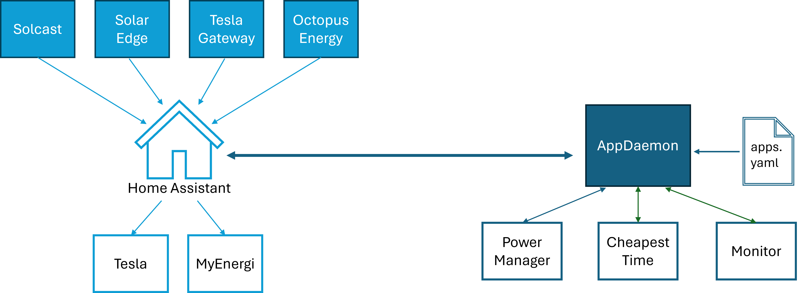

# AppDaemon modules

This project contains AppDeamon apps for use with [Home Assistant](https://github.com/home-assistant). [AppDaemon](https://github.com/AppDaemon) is a Python execution environment that makes it easier to create complex automations and scripts for Home Assistant. For more information about how AppDaemon complements Home Assistant, see the [AppDaemon Tutorial for HASS users](https://appdaemon.readthedocs.io/en/latest/HASS_TUTORIAL.html).

You can use the apps in this project to:

* Build a profile of the effective energy price for the day ahead and use this to control the behaviour of home batteries, and solar power diverters.
* Provide a list of the lowest priced energy time slots to Home Assistant. You can then use this information to turn appliances on or off.
* Monitor entities connected to Home Assistant and raise alerts when specified values are returned.

This documentation is a work in progress. If you have questions that are not currently answered by this content, please contact us.

## Architecture overview

These AppDaemon apps are loosely coupled. In order to share data between apps, the data is sent to and retrieved from Home Assistant. The apps do not communicate with each other directly.

Each app is instantiated and configured using an AppDaemon configuration file. An example YAML configuration file is included for reference.

## Power Manager

Power Manager uses data from multiple Home Assistant integrations to create a forecast of energy generation and consumption for the day ahead. It uses this information to:

* Calculate the most cost-effective way to use solar, battery and grid power. Power Manager then sends this plan to Home Assistant in order to control the relevant devices.
* Provide details of the cheapest time slots for consuming electricity to Home Assistant. This data can then be used by the Cheapest Time app to turn appliances on and off.

### Energy generation and consumption forecast

Power Manager uses a number of sources to build the energy generation and consumption forecast:

* Solar forecast data from [Solcast](https://github.com/696GrocuttT/ha-solcast-solar). This provides a basic estimate of solar production for the coming day.
* Historic solar production data from a solar inverter. This data is used to refine the solar forecast for local conditions. This is useful if shade from buildings or trees reduces solar production at a particular point in the day. Power Manager has been designed to use data from [SolarEdge](https://github.com/696GrocuttT/solaredge-modbus-hass). Integrations with other solar inverters that provide data in the same format should also work but some modifications may be needed.
* The current battery level and home energy usage from [Tesla Powerwall](https://www.home-assistant.io/integrations/powerwall/), together with historic values from this integration that are available from Home Assistant.
* Electricity import and export costs and gas import costs from an energy provider. Power Manager has been designed to use data from [Octopus Energy](https://github.com/696GrocuttT/HomeAssistant-OctopusEnergy). Using an integration with another energy provider is likely to need some modifications.

Note: The exact length of the energy price profile depends on the data sources. For Agile Octopus, price data is provided daily until midnight the following night.

### Power plan and automations

Having built a forecast of energy generation and consumption for the day ahead, Power Manager calculates the most cost-effective way to use the available energy sources and when to export energy to the grid. This includes the best times to:

* Power the home from solar-generated electricity.
* Power the home from batteries.
* Power the home from the grid.
* Charge batteries using solar-generated electricity.
* Charge batteries from the grid.
* Divert solar-generated electricity to another system that would otherwise use gas (such as an immersion heater).
* Export solar-generated energy to the grid.
* Export energy stored in batteries to the grid.

The power plan uses historic energy consumption data (stored in Home Assistant) to create a plan that allows for typical energy usage. The aim is to ensure that when powering the home from batteries, there is sufficient charge to meet typical demand. For example, if the grid import cost is lowest in the afternoon, highest in the morning and average the night before, Power Manager will charge the batteries overnight up to a level sufficient to meet typical consumption and avoid the batteries going flat during peak time.

Power Manager uses the power plan to control devices in Home Assistant via the following integrations:

* [Tesla Gateway](https://github.com/696GrocuttT/ha-tesla-gateway)
* [MyEnergi solar diverter](https://github.com/696GrocuttT/ha-myenergi).

### Effective energy price profile

Power Manager uses the data from the previous steps to build a profile of the effective energy price for the coming day. It sends this information to Home Assistant for use by the Cheapest Time app.

The cost in the energy profile is either the grid import cost, the grid export cost or the cost of previously charging the battery. The applicable cost depends on whether you are using the grid, solar-generated electricity or the battery to power the house at a given point in time.

## Cheapest Time

Cheapest Time uses the effective energy price profile provided to Home Assistant to calculate the most cost-effective time to run home appliances. For example, you can use the information provided by Cheapest Time to turn on devices (such as a dishwasher or washing machine) at the most cost-effective time, taking into account the expected duration of the cycle.

Cheapest Time has been designed for use with [Bosch Home Connect](https://www.home-assistant.io/integrations/home_connect/). It could be adapted to work with other Home Assistant integrations but some modifications may be required.

You can instantiate multiple instances of Cheapest Time. This is useful if you want to control multiple appliances in Home Assistant.

## Monitor

Monitor listens to Home Assistant for notifications from selected entities and raises alerts if specified values are received. Monitor then sorts and formats the alerts before returning the prioritized list of notifications to Home Assistant for display on a card or physical device.

Use the AppDaemon configuration file to identify the entities in Home Assistant using a regular expression and specify the values. Monitor can listen for alerts from any entity in Home Assistant. For example, you can use Monitor to manage notifications for firmware updates, devices that have been turned on or off, a parcel by the door, a robot vacuum cleaner that is not docked or pet food running out.

## License

This software is licensed for non-commercial use under GPL v3.
